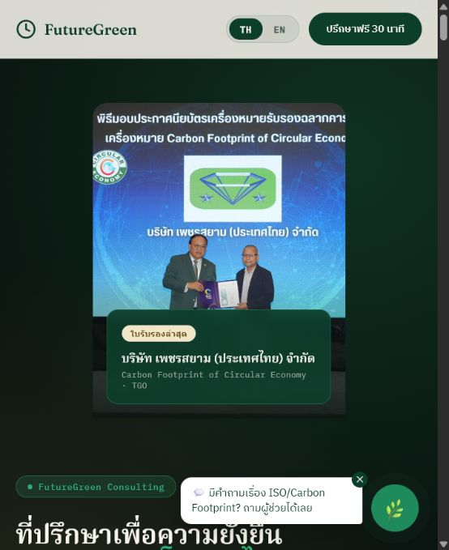

# FutureGreen Consulting

## Overview

FutureGreen Consulting is a bilingual consulting website and digital profile for ISO, ESG, Carbon Footprint, CFO, CFP, Net Zero, audit, training, and factory sustainability services.

The website helps Thai SME factories understand what sustainability requirements mean, where to start, and how FutureGreen by Sorawit can support practical implementation from readiness checks to certification preparation.

## Use Case

This website supports consulting work in:

- ISO 9001 / ISO 14001 consulting and certification readiness
- Carbon Footprint for Organization (CFO)
- Carbon Footprint of Product (CFP)
- ESG and sustainability roadmap planning
- Factory audit preparation and management-system improvement
- Lead generation and credibility building for Thai and English audiences

## Features

- Bilingual Thai / English content
- Consultant profile and field experience presentation
- Service sections for ISO, ESG, Carbon Footprint, CFO, CFP, training, and digital systems
- Knowledge hub for client-facing infographics and educational material
- Certification proof, research context, and consulting credibility sections
- Contact and lead-generation flow for prospective factory clients

## Tech Stack

- HTML
- CSS
- JavaScript
- GitHub Pages

## Demo

Live Demo: https://thesor55.github.io/futuregreen-consulting/

Knowledge Hub: https://thesor55.github.io/futuregreen-consulting/knowledge.html

## Status

MVP / Freelance consulting website

Custom domain migration to futuregreennet.com may be considered later.

## Screenshots

## Consultant Context

Developed by FutureGreen by Sorawit as the main digital profile for ISO, ESG, Carbon Footprint, and factory sustainability consulting services for Thai SME manufacturers.

## Development Notes

The website is bilingual Thai / English. Preserve the existing language switcher and data-th / data-en translation pattern when editing content.
